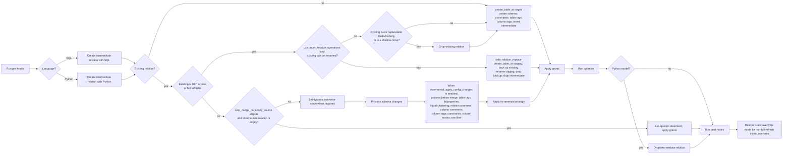

# Incremental Flow

_Last updated: 2026-09-24_

> Two diagrams follow: **Existing** is the default path, **New** is used when the
> `use_materialization_v2` behavior flag is enabled. See [flow/README.md](README.md) for what the
> flag is and how the selection works. Source:
> `dbt/include/databricks/macros/materializations/incremental/incremental.sql`.

## Existing Incremental Flow

```mermaid
flowchart LR
    PRE[Run pre-hooks] --> EXIST{Existing relation?}
    EXIST -- no --> CREATE[Create target from model]
    CREATE --> NEWCFG["Apply constraints; table tags; column tags;<br/>Python tblproperties; persist docs"]

    EXIST -- yes --> REPLACE{"Existing is view, materialized view, or streaming table;\nor full refresh?"}
    REPLACE -- yes --> DROPNEEDED{"Not a replaceable Delta/Iceberg relation,\nor existing is a shallow clone?"}
    DROPNEEDED -- yes --> DROP[Drop existing relation]
    DROPNEEDED -- no --> RECREATE[Create or replace target from model]
    DROP --> RECREATE
    RECREATE --> WASVIEW{Existing was a view?}
    WASVIEW -- no --> REPLACECONST[Persist constraints]
    WASVIEW -- yes --> REPLACETAGS[Apply table tags]
    REPLACECONST --> REPLACETAGS
    REPLACETAGS --> REPLACECOLTAGS[Apply column tags]
    REPLACECOLTAGS --> REPLACEDOCS[Persist docs]

    REPLACE -- no --> SKIP{"skip_merge_on_empty_source eligible\nand model SQL returns no rows?"}
    SKIP -- yes --> SKIPPED[No-op main statement; apply grants]
    SKIP -- no --> DYNAMIC[Set dynamic overwrite mode when required]
    DYNAMIC --> DETECT[Detect configuration changes when enabled]
    DETECT --> TEMP[Create temporary relation from model]
    TEMP --> SCHEMA[Process schema changes]
    SCHEMA --> MERGE[Apply incremental strategy]
    MERGE --> CONFIG{"Configuration changes detected?"}
    CONFIG -- yes --> APPLYCFG["Apply in order: table tags; tblproperties;<br/>liquid clustering; row filter; column tags;<br/>constraints when contract-enforced and not HMS"]
    CONFIG -- no --> DOCS[Persist docs]
    APPLYCFG --> DOCS

    NEWCFG --> GRANTS[Apply grants]
    REPLACEDOCS --> GRANTS
    DOCS --> GRANTS
    GRANTS --> OPT[Run optimize]
    OPT --> POST[Run post-hooks]
    SKIPPED --> POST
    POST --> STATIC[Restore static overwrite mode for non-full-refresh insert_overwrite]
```

For an ordinary existing table, configuration changes are detected before the temporary relation
is built but are applied only after the incremental SQL runs. This ordering differs from V2.

With `skip_merge_on_empty_source` enabled, a SQL model whose strategy is `append`, `delete+insert`,
or `merge` without `not_matched_by_source_action`, and whose `on_schema_change` is `ignore`, first
probes the model SQL with `LIMIT 1`. When it returns no rows, the run skips everything from dynamic
overwrite mode through persist docs and optimize, so configuration changes are deferred until the
next run with data. Other strategies ignore the flag because an empty source can still delete or
overwrite rows.

## New Incremental Flow

The `skip_merge_on_empty_source` check matches the Existing path, except that it runs after the
intermediate relation is created and probes that relation instead of the model SQL.

V2 replaces only DLT relations, views, and full-refresh targets. An ordinary existing table takes
the incremental branch even when its configuration changes. Safe staging is selected only when
`use_safer_relation_operations` is enabled and the existing relation can be renamed; otherwise a
non-replaceable relation or shallow clone is dropped before `create_table_at`. Unlike the Existing
path, V2 does not call `persist_docs` — relation and column comments are handled via
`apply_config_changeset` or the create/insert path.
