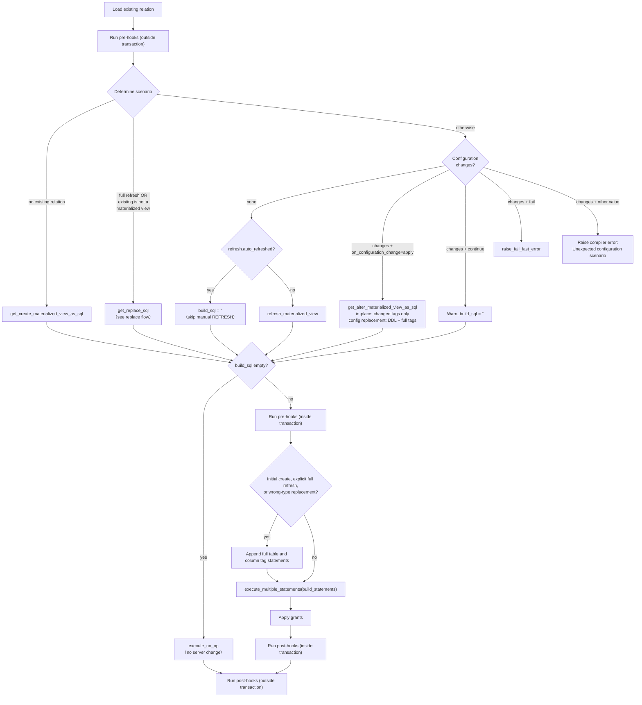

# Materialized View Flow

_Last updated: 2026-09-15_

> Materialized views do **not** use the `use_materialization_v2` flag — there is a single path.
> Source: `dbt/include/databricks/macros/materializations/materialized_view.sql`.

The materialized view materialization is structurally identical to the
[streaming table flow](streaming_table_flow.md): it computes a single `build_sql` for the one
scenario it is in (create / full replace / refresh / alter / no-op), then executes it or
short-circuits to a no-op. Only the underlying SQL helpers differ
(`get_create_materialized_view_as_sql`, `refresh_materialized_view`,
`get_alter_materialized_view_as_sql`).

Notes:

- See the [streaming table flow](streaming_table_flow.md) notes — the scenario selection, no-op
  handling, `on_configuration_change` semantics, and delegation to the shared
  [replace flow](replace_flow.md) are the same.
- Table- and column-tag changesets contain only changed keys; unchanged columns and unchanged keys
  within changed columns are omitted. Ordinary refreshes and unrelated alters do not reapply tags.
- Configuration-driven replacements append the complete desired table and column tag state to the
  replacement statement list. Initial creation, explicit full refresh, and wrong-type replacement
  append the same full desired state through `get_set_tag_statements` before executing the list.
