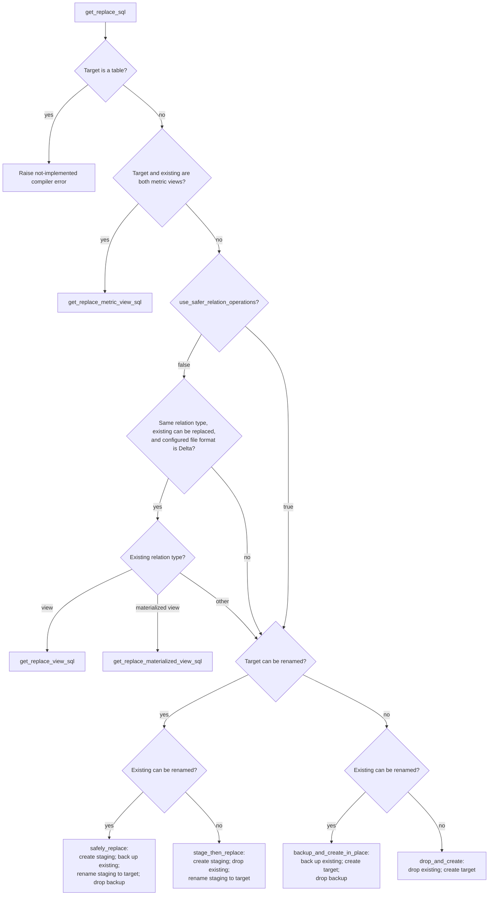

# Replace Flow

_Last updated: 2026-08-14_

Shared decision tree used when view, materialized-view, streaming-table, or metric-view helpers must
replace an existing relation. Table and incremental V2 use their dedicated
`create_table_at` / `safe_relation_replace` macros instead. Source:
`dbt/include/databricks/macros/relations/replace.sql`.

`get_replace_sql` does not support a table target: that input raises a not-implemented compiler
error before any replacement decision. Direct `CREATE OR REPLACE` for a metric-view target is used
only when the existing relation is also a metric view; otherwise the incompatible-type fallback
tree runs (table/view → `backup_and_create_in_place`, since metric views cannot be renamed).

Direct replacement is available only when safe operations are disabled and the existing and target
relations have the same type, the existing relation is replaceable, and the configured file format
is Delta. In practice, the supported direct branches here are views and materialized views; table
targets have already failed at the initial guard.

| Target can be renamed? | Existing can be renamed? | Fallback strategy |
| --- | --- | --- |
| Yes | Yes | `safely_replace` |
| Yes | No | `stage_then_replace` |
| No | Yes | `backup_and_create_in_place` |
| No | No | `drop_and_create` |
