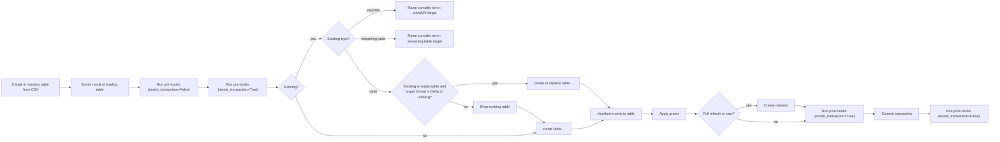
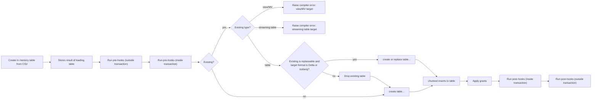

# Seed Flow

_Last updated: 2026-08-09_

> Two diagrams follow: **V1** is the default path, **V2** is used when the `use_materialization_v2`
> behavior flag is enabled. See [flow/README.md](README.md) for what the flag is and how the
> selection works. Source: `dbt/include/databricks/macros/materializations/seeds/seeds.sql`.

## V1 Seed Flow

## V2 Seed Flow

V2 uses the shared `run_pre_hooks` and `run_post_hooks` helpers, which preserve the outside/inside
pre-hook and inside/outside post-hook ordering. Unlike V1, V2 has no explicit `COMMIT` and does not
call `create_indexes`. A view/materialized-view target and a streaming-table target raise distinct
compiler errors.

