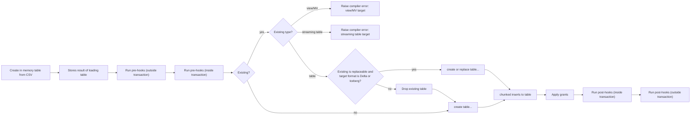

# Seed Flow

_Last updated: 2026-09-30_

> Seeds run a single path; the `use_materialization_v2` behavior flag does not affect them. See
> [flow/README.md](README.md) for the materializations that honor the flag. Source:
> `dbt/include/databricks/macros/materializations/seeds/seeds.sql`.

Pre-hooks and post-hooks run through the shared `run_pre_hooks` and `run_post_hooks` helpers, which
run the outside/inside pre-hook and inside/outside post-hook passes in that order. A
view/materialized-view target and a streaming-table target raise distinct compiler errors.

```mermaid
flowchart LR
    AGATE[Create in memory table from CSV]
    STORE[Stores result of loading table]
    PRE["Run pre-hooks (outside transaction)"]
    PRE2["Run pre-hooks (inside transaction)"]
    RAISEV[Raise compiler error: view/MV target]
    RAISEST[Raise compiler error: streaming table target]
    COR[create or replace table...]
    CREATE[create table...]
    DROP[Drop existing table]
    INSERT[chunked inserts to table]
    GRANTS[Apply grants]
    POST["Run post-hooks (inside transaction)"]
    POST2["Run post-hooks (outside transaction)"]
    D1{Existing?}
    D2{Existing type?}
    D3{"Existing is replaceable and\ntarget format is Delta or Iceberg?"}
    AGATE-->STORE
    STORE-->PRE
    PRE-->PRE2-->D1
    D1--yes-->D2
    D1--"no"-->CREATE
    D2--"view/MV"-->RAISEV
    D2--"streaming table"-->RAISEST
    D2--table-->D3
    D3--yes-->COR
    COR-->INSERT
    D3--"no"-->DROP
    DROP-->CREATE
    CREATE-->INSERT
    INSERT-->GRANTS
    GRANTS-->POST
    POST-->POST2
```
