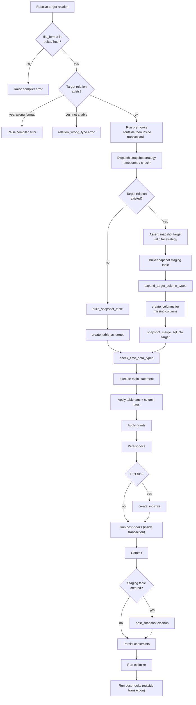

# Snapshot Flow

_Last updated: 2026-08-09_

> Snapshots do **not** use the `use_materialization_v2` flag — there is a single path. Source:
> `dbt/include/databricks/macros/materializations/snapshot.sql`. Strategy dispatch and the
> timestamp/check strategies are inherited from dbt Core; `snapshot_helpers.sql` contains the
> Databricks-specific merge, column, build, and staging helpers.

A snapshot always materializes to a `table`. The first run builds the table directly from the
snapshot query; subsequent runs stage the incoming rows, reconcile columns, and `MERGE` change
records into the existing snapshot table.

Notes:

- **Format guard**: snapshots require `delta` or `hudi`; any other `file_format`, or an existing
  target in another format, raises a compiler error before any work is done.
- **First run vs. subsequent runs**: the branch on whether the target already existed is the
  central decision — a fresh `create_table_as` versus stage-and-`MERGE`.
- **Column reconciliation** (subsequent runs only): dbt drops its internal bookkeeping columns
  (`dbt_change_type`, `dbt_unique_key`, …) from the diff, expands types, and adds any genuinely
  missing columns to the target before merging.
