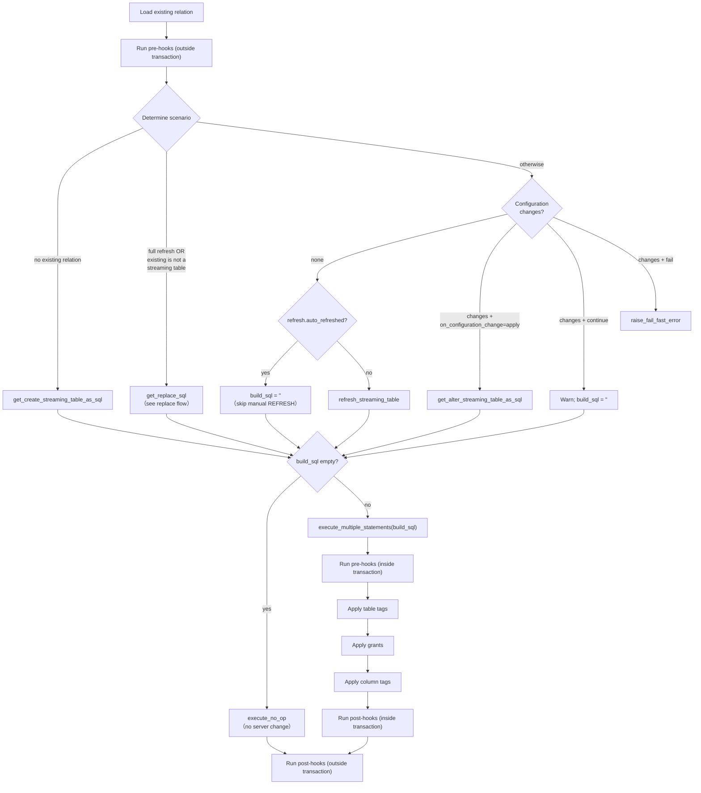

# Streaming Table Flow

_Last updated: 2026-08-09_

> Streaming tables do **not** use the `use_materialization_v2` flag — there is a single path.
> Source: `dbt/include/databricks/macros/materializations/streaming_table.sql`.
> [Materialized views](materialized_view_flow.md) follow the same shape.

The materialization computes a single `build_sql` describing the one scenario it is in (create /
full replace / refresh / alter / no-op), then either executes it or short-circuits to a no-op when
nothing needs to change.

Notes:

- **Scenario selection** happens in `streaming_table_get_build_sql`, which returns the SQL string
  (possibly empty) for exactly one scenario.
- **No-op re-runs**: when there are no configuration changes and the streaming table is
  auto-refreshed, `build_sql` is empty and the run resolves to `execute_no_op` — no manual
  `REFRESH` is issued.
- **`on_configuration_change`** governs what happens when config drift is detected:
  `apply` alters in place, `continue` warns and skips, `fail` raises immediately.
- **Replace** (full refresh, or the existing relation is not a streaming table) delegates to the
  shared [replace flow](replace_flow.md).
