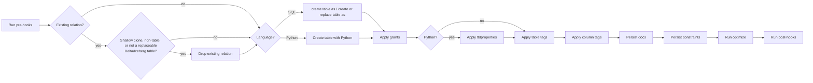
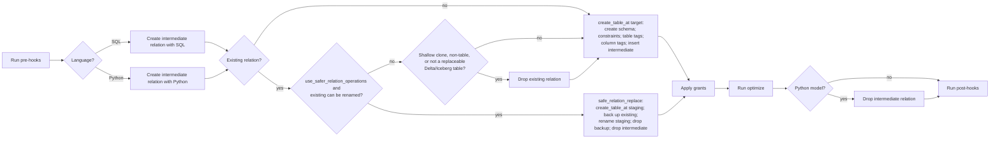

# Table Flow

_Last updated: 2026-08-23_

> Two diagrams follow: **V1** is the default path, **V2** is used when the `use_materialization_v2`
> behavior flag is enabled. See [flow/README.md](README.md) for what the flag is and how the
> selection works. Source: `dbt/include/databricks/macros/materializations/table.sql`.

For SQL models on dbt-core versions that expose typed materialization execution, the adapter now
resolves the same flow into an ordered Python operation plan before mutation begins. Logical table
format, physical Delta versus managed-Iceberg provider, catalog type/provider, DBR capabilities,
and live replacement safety are plan inputs. The macros remain compatibility fallbacks and leaf SQL
renderers; they are not the source of those decisions on the typed path.

The serialization boundary is deliberate: the plan owns every decision that changes the selected
strategy, operation ordering, replacement safety, or SQL renderer variant. Relations, compiled SQL,
resolved columns, and literal configuration payloads such as tag values remain late-bound execution
arguments. Leaf renderers may interpolate those values, but must not re-resolve catalog, format,
provider, runtime, version, or capability policy when plan facts are present.

## V1 Table Flow

V1 calls `run_hooks(pre_hooks)` without the outside/inside split used by seed and snapshot.

## V2 Table Flow

On the typed SQL path, `create_table_at` is decomposed into explicit create-structure,
alter-constraint, table-tag, column-tag, and insert-from-intermediate operations. The compatibility
macro composes those same leaf macros for callers that have not opted into typed execution. The
safe-replacement path performs its own intermediate cleanup; Python paths also clean up the
intermediate relation after optimization. Unlike V1, V2 does not call `persist_docs` — column and
relation comments are handled on the create/insert path.
