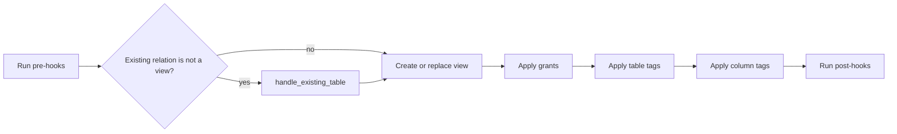
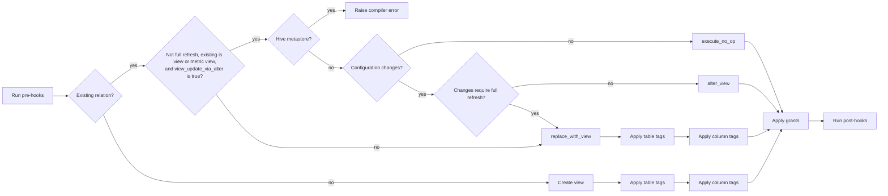

# View Flow

_Last updated: 2026-08-09_

> Two diagrams follow: **V1** is the default path, **V2** is used when the `use_materialization_v2`
> behavior flag is enabled. See [flow/README.md](README.md) for what the flag is and how the
> selection works. Source: `dbt/include/databricks/macros/materializations/view.sql`.

## V1 View Flow

## V2 View Flow

Replacement branches use the shared [replace flow](replace_flow.md).

`relation_should_be_altered` rejects the Hive metastore when alter-in-place was requested. A
replacement applies table and column tags after `get_replace_sql`; an in-place alter applies the
configuration changes returned by relation configuration comparison.
