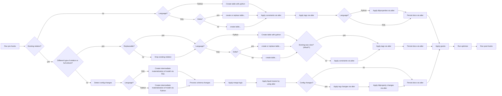
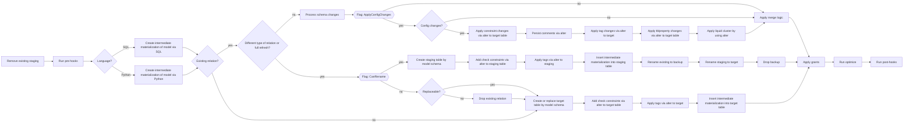

# Incremental Flow

## Existing Incremental Flow

```mermaid
flowchart LR
    PRE[Run pre-hooks]
    CSQL[create table...]
    CSQLD[create or replace table...]
    CPY[Create table with python]
    CSQL2[create table...]
    CSQLD2[create or replace table...]
    CPY2[Create table with python]
    CONST[Apply constraints via alter]
    TAGS[Apply tags via alter]
    PYTBL[Apply tblproperties via alter]
    DOCS[Persist docs via alter]
    DROP[Drop existing relation]
    CONST2[Apply constraints via alter]
    TAGS2[Apply tags via alter]
    DOCS2[Persist docs via alter]
    CHANGE[Detect config changes]
    INT[Create intermediate materialization of model via SQL]
    INTPY[Create intermediate materialization of model via Python]
    SCHEMA[Process schema changes]
    MERGE[Apply merge logic]
    LIQUID[Apply liquid cluster by using alter]
    TAGS3[Apply tag changes via alter]
    TBLP[Apply tblproperty changes via alter]
    DOCS3[Persist docs via alter]
    GRANTS[Apply grants]
    OPT[Run optimize]
    POST[Run post-hooks]
    D1{Existing relation?}
    D2{Different type of relation or full refresh?}
    D3{Language?}
    D4{Delta?}
    D5{Language?}
    D6{Replaceable?}
    D7{Language?}
    D8{Delta?}
    D9{"Existing was view? (What?!)"}
    D10{Language?}
    D11{Config changes?}
    PRE-->D1
    D1--yes-->D2
    D1--"no"-->D3
    D3--SQL-->D4
    D3--Python-->CPY
    D4--yes-->CSQLD
    D4--"no"-->CSQL
    CPY-->CONST
    CSQLD-->CONST
    CSQL-->CONST
    CONST-->TAGS
    TAGS-->D5
    D5--Python-->PYTBL
    PYTBL-->DOCS
    D5--SQL-->DOCS
    D2--yes-->D6
    D6--yes-->D7
    D6--"no"-->DROP
    DROP-->D7
    D7--SQL-->D8
    D7--Python-->CPY2
    D8--yes-->CSQLD2
    D8--"no"-->CSQL2
    CPY2-->D9
    CSQLD2-->D9
    CSQL2-->D9
    D9--yes-->TAGS2
    D9--"no"-->CONST2
    CONST2-->TAGS2
    TAGS2-->DOCS2
    D2--"no"-->CHANGE
    CHANGE-->D10
    D10--SQL-->INT
    D10--Python-->INTPY
    INT-->SCHEMA
    INTPY-->SCHEMA
    SCHEMA-->MERGE
    MERGE-->LIQUID
    LIQUID-->D11
    D11--yes-->TAGS3
    TAGS3-->TBLP
    D11--"no"-->DOCS3
    TBLP-->DOCS3
    DOCS-->GRANTS
    DOCS2-->GRANTS
    DOCS3-->GRANTS
    GRANTS-->OPT
    OPT-->POST
```

## New Incremental Flow

```mermaid
flowchart LR
    CLEANUP[Remove existing staging]
    PRE[Run pre-hooks]
    INT[Create intermediate materialization of model via SQL]
    INTPY[Create intermediate materialization of model via Python]
    FINAL[Create or replace target table by model schema]
    STAGE[Create staging table by model schema]
    DROP[Drop existing relation]
    CHECK[Add check constraints via alter to target table]
    CHECK2[Add check constraints via alter to staging table]
    CHECK3[Apply constraint changes via alter to target table]
    TBLP[Apply tblproperty changes via alter to taget table]
    TAGS[Apply tags via alter to target]
    TAGS2[Apply tags via alter to staging]
    TAGS3[Apply tag changes via alter to target]
    INSERT[Insert intermediate materialization into target table]
    INSERT2[Insert intermediate materialization into staging table]
    RENAME[Rename existing to backup]
    RENAME2[Rename staging to target]
    SCHEMA[Process schema changes]
    LIQUID[Apply liquid cluster by using alter]
    DROP2[Drop backup]
    MERGE[Apply merge logic]
    DOCS[Persist comments via alter]
    GRANTS[Apply grants]
    OPT[Run optimize]
    POST[Run post-hooks]
    F1{{Flag: CanRename}}
    F2{{Flag: ApplyConfigChanges}}
    D0{Language?}
    D1{Existing relation?}
    D2{Different type of relation or full refresh?}
    D3{Replaceable?}
    D4{Config changes?}
    CLEANUP-->PRE
    PRE-->D0
    D0--SQL-->INT
    D0--Python-->INTPY
    INT-->D1
    INTPY-->D1
    D1--yes-->D2
    D2--yes-->F1
    D2--"no"-->SCHEMA
    SCHEMA-->F2
    F2--yes-->D4
    F2--"no"-->MERGE
    D4--yes-->CHECK3
    D4--"no"-->MERGE
    CHECK3-->DOCS
    DOCS-->TAGS3
    TAGS3-->TBLP
    TBLP-->LIQUID
    LIQUID-->MERGE
    MERGE-->GRANTS
    F1--yes-->STAGE
    F1--"no"-->D3
    D3--yes-->FINAL
    D3--"no"-->DROP
    DROP-->FINAL
    STAGE-->CHECK2
    CHECK2-->TAGS2
    TAGS2-->INSERT2
    INSERT2-->RENAME
    RENAME-->RENAME2
    RENAME2-->DROP2
    DROP2-->GRANTS
    D1--"no"-->FINAL
    FINAL-->CHECK
    CHECK-->TAGS
    TAGS-->INSERT
    INSERT-->GRANTS
    GRANTS-->OPT
    OPT-->POST

```
