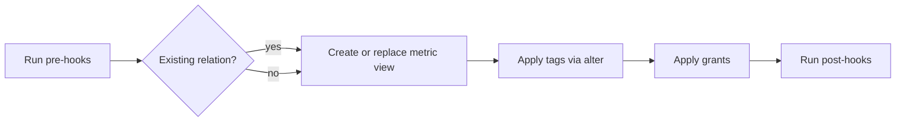
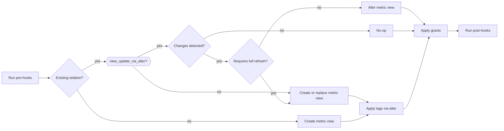

---
Metric View Flow
---

# Metric View Flow

Metric views support two modes of operation:
1. **Default behavior**: Always use `CREATE OR REPLACE` for updates
2. **Opt-in ALTER behavior**: Use `ALTER VIEW AS` when `view_update_via_alter: true` is configured

## Default Metric View Flow (without view_update_via_alter)



In this mode, metric views are always replaced using `CREATE OR REPLACE VIEW ... WITH METRICS`, regardless of what changed.

## Metric View Flow with view_update_via_alter



When `view_update_via_alter: true` is set, the adapter:
1. Detects configuration changes between existing and target metric view
2. Applies changes via `ALTER VIEW` when possible (query, tags, tblproperties, column comments)
3. Falls back to `CREATE OR REPLACE` only when necessary (comment changes)

## Configuration Changes

### Alterable via ALTER VIEW (no full refresh)

- **Query changes**: Applied via `ALTER VIEW ... AS (...)`
- **Tags**: Applied via `ALTER VIEW ... SET TAGS`
- **Tblproperties**: Applied via `ALTER VIEW ... SET TBLPROPERTIES`
- **Column comments**: Applied via `ALTER VIEW ... ALTER COLUMN ... COMMENT`

### Require CREATE OR REPLACE (full refresh)

- **Comment (view description)**: No API to alter view comments in Databricks

## Usage

To enable ALTER-based updates for metric views:

```yaml
# dbt_project.yml
models:
  my_project:
    metric_views:
      +view_update_via_alter: true
```

Or in a model config:

```sql
{{
  config(
    materialized='metric_view',
    view_update_via_alter=true
  )
}}

version: 0.1
source: my_table
dimensions:
  - name: dimension1
    expr: column1
measures:
  - name: measure1
    expr: count(1)
```

## Benefits of view_update_via_alter

1. **Faster updates**: Avoids dropping and recreating the metric view
2. **Preserved metadata**: Maintains view history and metadata across runs
3. **Selective updates**: Only applies changes that actually differ from existing state
4. **Atomic operations**: Uses ALTER statements that succeed or fail atomically

## Limitations

- **Unity Catalog only**: ALTER VIEW operations are not supported for Hive Metastore
- **Comment changes**: Still require full refresh as Databricks doesn't support altering view comments
- **Requires v2 materialization**: Must have `use_materialization_v2: true` flag set
