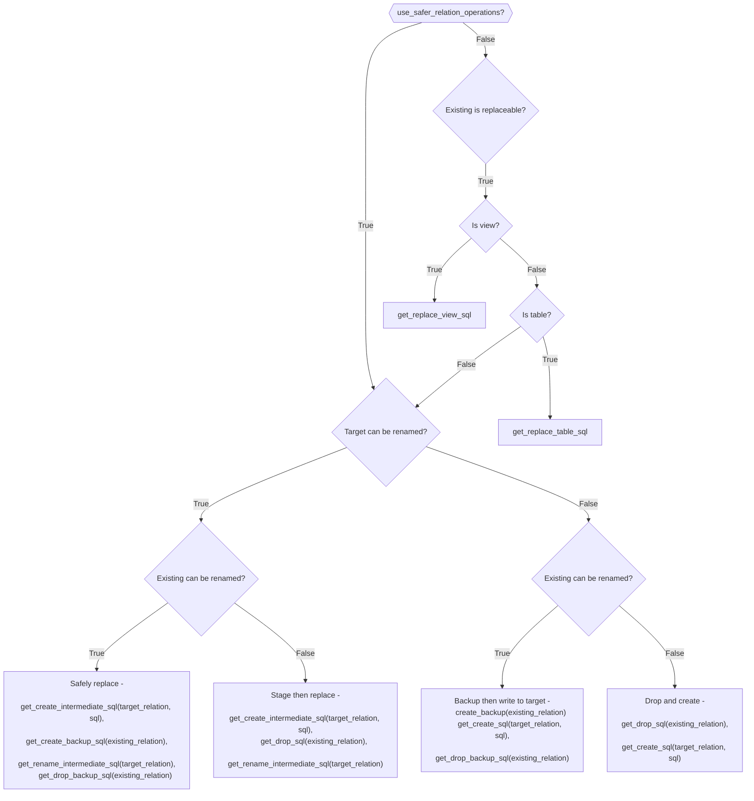

---
Replace Flow
---

# Replace Flow

Diagram of the replace decision tree.

| Existing type    | Target type      | Safe Replace? | Outcome              |
| ---------------- | ---------------- | ------------- | -------------------- |
| VIEW             | VIEW             | True          | Safely replace       |
| VIEW(Delta)      | VIEW(Delta)      | False         | CREATE OR REPLACE... |
| VIEW(Non-delta)  | VIEW(Delta)      | Either        | Safely replace       |
| VIEW(Delta)      | VIEW(Non-delta)  | Either        | Safely replace       |
| VIEW             | TABLE            | Either        | Safely replace       |
| VIEW             | MV/ST            | Either        | Backup then replace  |
| TABLE            | TABLE            | True          | Safely replace       |
| TABLE(Delta)     | TABLE(Delta)     | False         | CREATE OR REPLACE... |
| TABLE(Non-delta) | TABLE(Delta)     | Either        | Safely replace       |
| TABLE(Delta)     | TABLE(Non-delta) | Either        | Safely replace       |
| TABLE            | VIEW             | Either        | Safely replace       |
| TABLE            | MV/ST            | Either        | Backup then replace  |
| MV/ST            | MV/ST            | Either        | Drop and create      |
| MV/ST            | VIEW             | Either        | Stage then replace   |
| MV/ST            | TABLE            | Either        | Stage then replace   |
