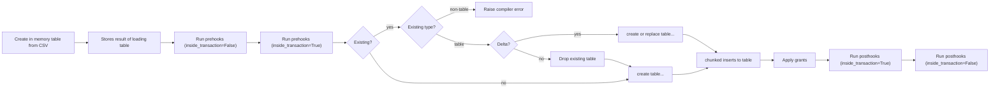

---
Seed Flow
---

# V1 Seed Flow

```mermaid
flowchart LR
    AGATE[Create in memory table from CSV]
    STORE[Stores result of loading table]
    PRE["Run prehooks (inside_transaction=False)"]
    PRE2["Run prehooks (inside_transaction=True)"]
    RAISE[Raise compiler error]
    COR[create or replace table...]
    CREATE[create table...]
    DROP[Drop existing table]
    INSERT[chunked inserts to table]
    GRANTS[Apply grants]
    INDEX["Create indexes (What?!)"]
    POST["Run posthooks (inside_transaction=True)"]
    POST2["Run posthooks (inside_transaction=False)"]
    COMMIT["Commit transaction (What?!)"]
    D1{Existing?}
    D2{Existing type?}
    D3{Delta?}
    AGATE-->STORE
    STORE-->PRE
    PRE-->PRE2-->D1
    D1--yes-->D2
    D1--"no"-->CREATE
    D2--"non-table"-->RAISE
    D2--table-->D3
    D3--yes-->COR
    COR-->INSERT
    D3--"no"-->DROP
    DROP-->CREATE
    CREATE-->INSERT
    INSERT-->GRANTS
    GRANTS-->INDEX
    INDEX-->POST
    POST-->COMMIT
    COMMIT-->POST2
```

# V2 Seed Flow

Other than some cleanup, V2 mostly just removes calls that we don't support

```mermaid
flowchart LR
    AGATE[Create in memory table from CSV]
    STORE[Stores result of loading table]
    PRE["Run prehooks (inside_transaction=False)"]
    PRE2["Run prehooks (inside_transaction=True)"]
    RAISE[Raise compiler error]
    COR[create or replace table...]
    CREATE[create table...]
    DROP[Drop existing table]
    INSERT[chunked inserts to table]
    GRANTS[Apply grants]
    POST["Run posthooks (inside_transaction=True)"]
    POST2["Run posthooks (inside_transaction=False)"]
    D1{Existing?}
    D2{Existing type?}
    D3{Delta?}
    AGATE-->STORE
    STORE-->PRE
    PRE-->PRE2-->D1
    D1--yes-->D2
    D1--"no"-->CREATE
    D2--"non-table"-->RAISE
    D2--table-->D3
    D3--yes-->COR
    COR-->INSERT
    D3--"no"-->DROP
    DROP-->CREATE
    CREATE-->INSERT
    INSERT-->GRANTS
    GRANTS-->POST
    POST-->POST2
```
