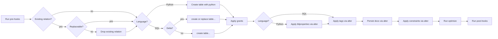
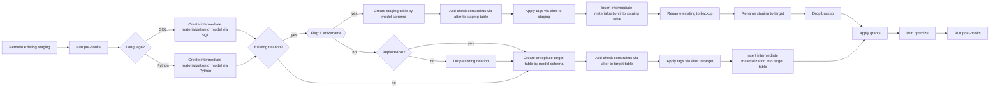

---
Table Flow
---

# V1 Table Flow

```mermaid
flowchart LR
    PRE[Run pre-hooks]
    DROP[Drop existing relation]
    CSQL[create table...]
    CSQLD[create or replace table...]
    CPY[Create table with python]
    GRANTS[Apply grants]
    PYTBL[Apply tblproperties via alter]
    TAGS[Apply tags via alter]
    DOCS[Persist docs via alter]
    CONST[Apply constraints via alter]
    OPT[Run optimize]
    POST[Run post-hooks]
    D1{Existing relation?}
    D2{Replaceable?}
    D3{Language?}
    D4{Delta?}
    D5{Language?}
    PRE-->D1
    D1--yes-->D2
    D1--"no"-->D3
    D2--yes-->D3
    D2--"no"-->DROP
    DROP-->D3
    D3--SQL-->D4
    D3--Python-->CPY
    D4--yes-->CSQLD
    D4--"no"-->CSQL
    CPY-->GRANTS
    CSQLD-->GRANTS
    CSQL-->GRANTS
    GRANTS-->D5
    D5--Python-->PYTBL
    D5--SQL-->TAGS
    PYTBL-->TAGS
    TAGS-->DOCS
    DOCS-->CONST
    CONST-->OPT
    OPT-->POST
```

# V2 Table Flow

```mermaid
flowchart LR
    PRE[Run pre-hooks]
    CLEANUP[Remove existing staging]
    INT[Create intermediate materialization of model via SQL]
    INTPY[Create intermediate materialization of model via Python]
    STAGE[Create staging table by model schema]
    FINAL[Create or replace target table by model schema]
    DROP[Drop existing relation]
    CHECK[Add check constraints via alter to target table]
    CHECK2[Add check constraints via alter to staging table]
    INSERT[Insert intermediate materialization into target table]
    INSERT2[Insert intermediate materialization into staging table]
    RENAME[Rename existing to backup]
    RENAME2[Rename staging to target]
    DROP2[Drop backup]
    TAGS[Apply tags via alter to target]
    TAGS2[Apply tags via alter to staging]
    GRANTS[Apply grants]
    OPT[Run optimize]
    POST[Run post-hooks]
    F1{{Flag: CanRename}}
    D0{Language?}
    D1{Existing relation?}
    D2{Replaceable?}
    CLEANUP-->PRE
    PRE-->D0
    D0--SQL-->INT
    D0--Python-->INTPY
    INT-->D1
    INTPY-->D1
    D1--yes-->F1
    D1--"no"-->FINAL
    F1--yes-->STAGE
    F1--"no"-->D2
    D2--"yes"-->FINAL
    D2--"no"-->DROP
    DROP-->FINAL
    FINAL-->CHECK
    STAGE-->CHECK2
    CHECK-->TAGS
    TAGS-->INSERT
    CHECK2-->TAGS2
    TAGS2-->INSERT2
    INSERT2-->RENAME
    RENAME-->RENAME2
    RENAME2-->DROP2
    DROP2-->GRANTS
    INSERT-->GRANTS
    GRANTS-->OPT
    OPT-->POST
```
