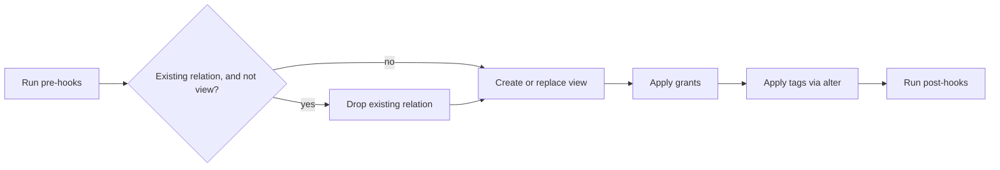
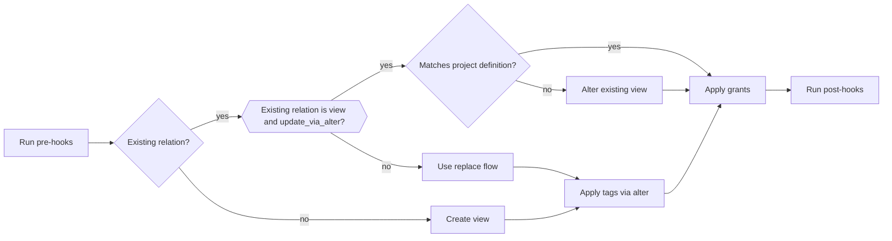

---
View Flow
---

# V1 View Flow

```mermaid
flowchart LR
    PRE[Run pre-hooks]
    DROP[Drop existing relation]
    CREATE[Create or replace view]
    GRANTS[Apply grants]
    TAGS[Apply tags via alter]
    POST[Run post-hooks]
    D1{Existing relation, and not view?}
    PRE-->D1
    D1--yes-->DROP
    D1--"no"-->CREATE
    DROP-->CREATE
    CREATE-->GRANTS
    GRANTS-->TAGS
    TAGS-->POST
```

# V2 View Flow

See [replace flow](replace_flow.md) for details.

```mermaid
flowchart LR
    PRE[Run pre-hooks]
    ALTER[Alter existing view]
    CREATE[Create view]
    GRANTS[Apply grants]
    TAGS[Apply tags via alter]
    POST[Run post-hooks]
    REPLACE_FLOW[Use replace flow]
    D1{Existing relation?}
    D2{{Existing relation is view and update_via_alter?}}
    D4{Matches project definition?}
    PRE-->D1
    D1--yes-->D2
    D1--"no"-->CREATE
    D2--yes-->D4
    D2--"no"-->REPLACE_FLOW
    REPLACE_FLOW-->TAGS
    D4--yes-->GRANTS
    D4--"no"-->ALTER
    ALTER-->GRANTS
    CREATE-->TAGS
    TAGS-->GRANTS
    GRANTS-->POST
```
