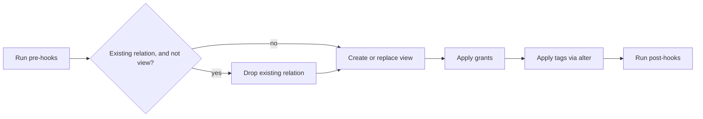
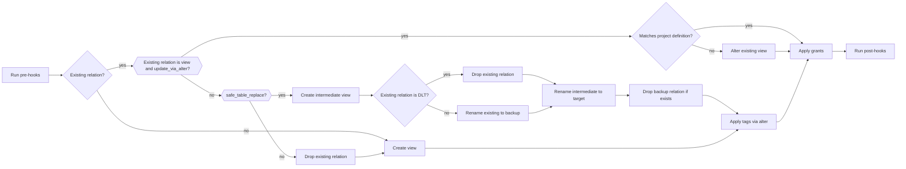

---
View Flow
---

# V1 View Flow

```mermaid
flowchart LR
    PRE[Run pre-hooks]
    DROP[Drop existing relation]
    CREATE[Create or replace view]
    GRANTS[Apply grants]
    TAGS[Apply tags via alter]
    POST[Run post-hooks]
    D1{Existing relation, and not view?}
    PRE-->D1
    D1--yes-->DROP
    D1--"no"-->CREATE
    DROP-->CREATE
    CREATE-->GRANTS
    GRANTS-->TAGS
    TAGS-->POST
```

# V2 View Flow

```mermaid
flowchart LR
    PRE[Run pre-hooks]
    DROP[Drop existing relation]
    DROP2[Drop backup relation if exists]
    DROPALT[Drop existing relation]
    ALTER[Alter existing view]
    INT[Create intermediate view]
    BACKUP[Rename existing to backup]
    PROMOTE[Rename intermediate to target]
    CREATE[Create view]
    GRANTS[Apply grants]
    TAGS[Apply tags via alter]
    POST[Run post-hooks]
    F1{{safe_table_replace?}}
    D1{Existing relation?}
    D2{{Existing relation is view and update_via_alter?}}
    D3{Existing relation is DLT?}
    D4{Matches project definition?}
    PRE-->D1
    D1--yes-->D2
    D1--"no"-->CREATE
    D2--yes-->D4
    D2--"no"-->F1
    F1--"no"-->DROP
    F1--yes-->INT
    D3--yes-->DROPALT
    DROPALT-->PROMOTE
    INT-->D3
    D3--"no"-->BACKUP
    BACKUP-->PROMOTE
    PROMOTE-->DROP2
    DROP2-->TAGS
    D4--yes-->GRANTS
    D4--"no"-->ALTER
    ALTER-->GRANTS
    DROP-->CREATE
    CREATE-->TAGS
    TAGS-->GRANTS
    GRANTS-->POST
```
